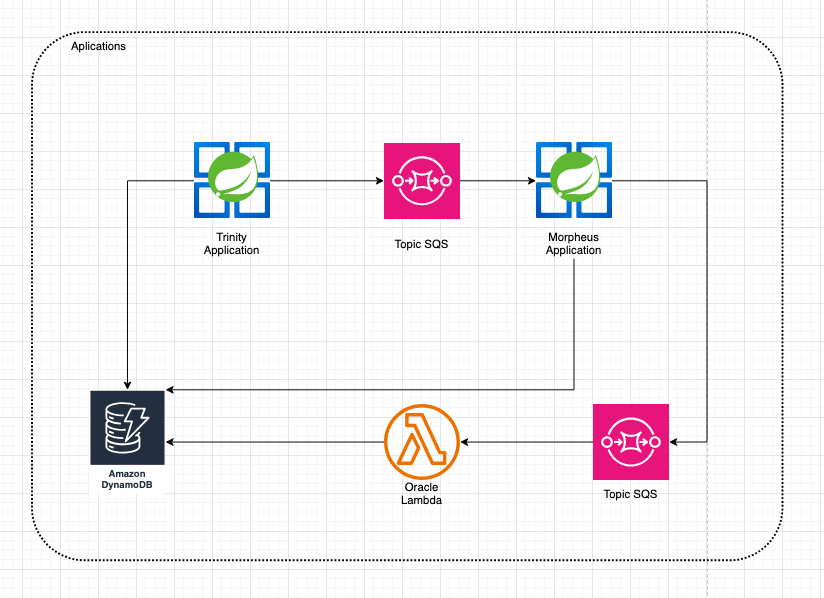

# Morpheus

Morpheus is a Spring Boot application built on AWS Cloud services, inspired by the Matrix universe. Its purpose is to simulate a decision-making system between choosing the red or blue pill — and forwarding the journey to the Oracle if necessary.

---

  

## Features

- **GET /fight**: Returns a random martial art that Morpheus can train you in.
- **SQS Listener**: Listens to a `person` queue and randomly offers the red or blue pill to the user.
- **Business Rules**:
    - If the **blue pill** is chosen:
        - A message is stored in a DynamoDB table with the state `"WAKE UP"`.
        - The person wakes up in their bed, as if nothing had happened.
    - If the **red pill** is chosen:
        - A message is published to an SQS topic.
        - A Lambda function called **Oracle** will decide if this person is "The One".

---

## API Endpoints

| Method | Endpoint     | Description                     |
|--------|--------------|---------------------------------|
| GET    | `/fight`     | Returns a random martial art    |

---

## ☁AWS Integration

| Service       | Purpose                                         |
|---------------|--------------------------------------------------|
| **SQS**       | Receives `Person` messages to trigger pill choice |
| **DynamoDB**  | Stores blue pill decisions with status `WAKE UP` |
| **Lambda**    | Oracle analyzes red pill takers                  |

---

## Tech Stack

- Java 17 + Spring Boot 3.4.4
- AWS SDK v2 (SQS, DynamoDB)
- GraalVM Native Image (Docker build)
- Spring Cloud AWS 3.1.0
- CI/CD: GitHub Actions